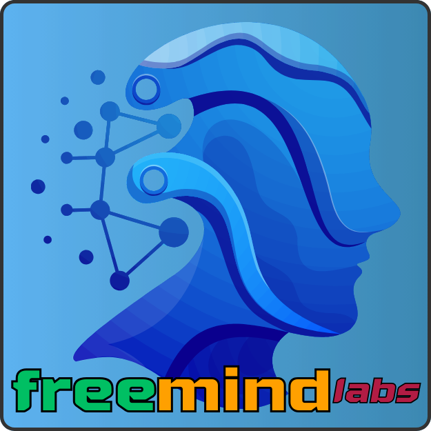
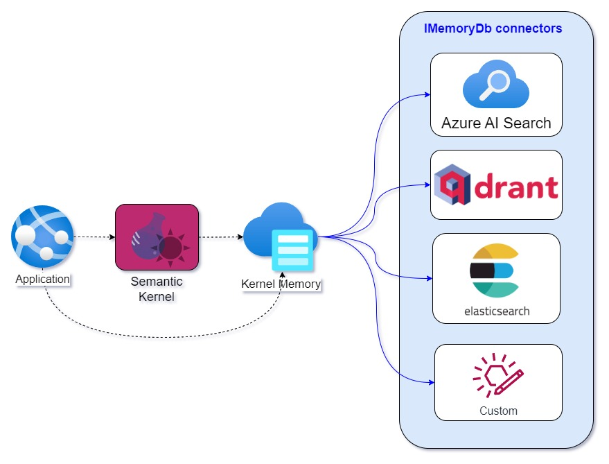

Welcome to Free Mind Labs, *a vanguard in AI-driven personal data analysis.*

   

## Our Vision

Our vision is to harness AI for *deep exploration into your personal data*, such as your YouTube history, smartphone-recorded videos, and all your writings on media platforms like Facebook and others.

The [Elasticsearch Kernel Memory connector](https://github.com/freemindlabsinc/FreeMindLabs.KernelMemory.Elasticsearch), our current breakthrough, paves the way for this exploration. It’s a foundational component for our more extensive project, [Videomatic](https://github.com/freemindlabsinc/videomatic), which will offer unprecedented insights into your evolving interests and personal journey.

  

Supporting us means joining a mission **to transform personal data into a powerful tool for self-discovery.**

## The Future

By investing in our products, you're not just supporting technological innovation; you're also helping us build Gaia, our vision for a sustainable, cooperative future. Gaia represents our commitment to creating an eco-village where technology, sustainability, and community merge.

It's a real-world embodiment of our belief that technology should not only serve individual needs but also foster collective well-being and environmental harmony.

Thank you for your support!
